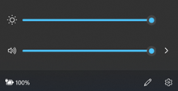
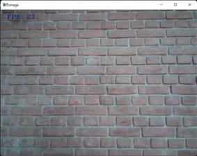
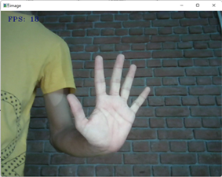
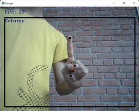
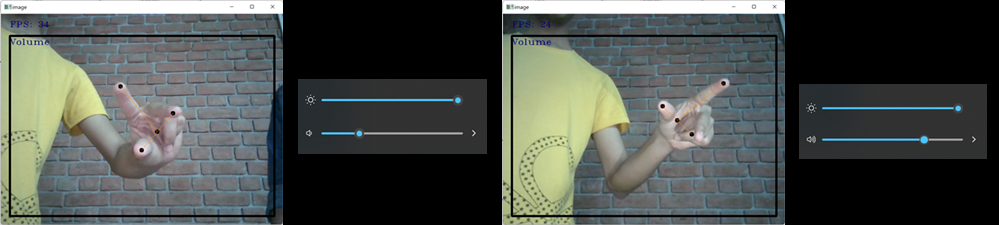
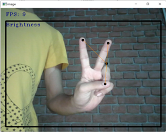
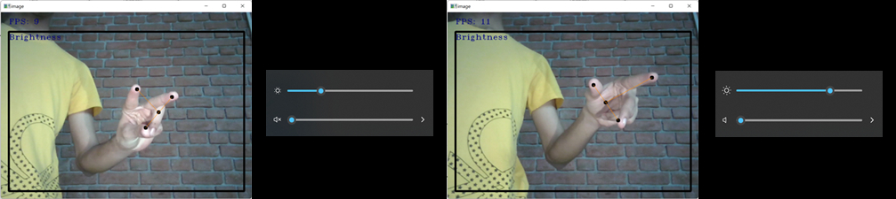
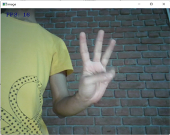

## License

This project is licensed under the Apache 2.0 License - see the [LICENSE](LICENSE) file for details.

# Hand Gesture Recognition for System Control

A project by **Chirag Rathi** for Amity University, demonstrating real-time gesture control for system volume and brightness using Python, OpenCV, and MediaPipe.

## Abstract

This project is a Hand Gesture Recognition System that uses a standard computer camera to control system operations like volume and brightness. It leverages the MediaPipe library for robust hand and finger tracking, laying an exo-skeleton over the hand in real-time. OpenCV is used to process the video feed and draw visual feedback for the user. The system is designed to be intuitive, using specific finger counts to navigate a menu and a "dial" gesture to adjust settings.

## Features

-   **Volume Control:** Adjust the system's master volume by making a rotating gesture with your hand.
-   **Brightness Control:** Adjust the screen brightness using the same gesture.
-   **Menu System:** Use simple hand gestures (e.g., showing 1, 2, 3, or 5 fingers) to switch between modes or exit the application.
-   **Real-time Visual Feedback:** The application window shows the camera feed, detected hand landmarks, and the current control mode.

## Technologies Used

-   **Programming Language:** Python 3
-   **Core Libraries:**
    -   **OpenCV:** For video capture and drawing visuals.
    -   **MediaPipe:** For hand detection and landmark tracking.
    -   **pycaw:** For controlling system audio on Windows.
    -   **screen-brightness-control:** For controlling screen brightness.
    -   **comtypes & ctypes:** Low-level libraries for interfacing with Windows APIs.
-   **Environment:** `conda` for managing isolated Python environments. (Install using `requirements.txt`)

## Setup and Installation

1.  **Clone the repository**

2.  **Create and activate a virtual environment:**
    ```bash
    # Using Conda (Recommended)
    conda create --name gesture-env python=3.9
    conda activate gesture-env
    ```

3.  **Install the required packages:**
    ```bash
    pip install -r requirements.txt
    ```

4.  **Run the application:**
    ```bash
    python main.py
    ```

---

**Initial Brightness and Volume of the System**



---

**Observation 1:**
-   On start-up of the program no object is detected.
-   Top left corner indicates the frames per second i.e., fps

**Result:**
-   Indication that code is running without errors.



---

**Observation 2:**
-   Hand is detected but hand mask is turned off for clean functioning.
-   The 5 fingers gesture activates menu of the code.

**Result:**
-   So far code is running without errors.



---

**Observation 3:**
-   Hand gesture of "1 finger up" is detected.
-   A rectangular boundary is generated with top left corner named as its control function.
-   Required fingers are mapped.

**Result:**
-   Entered in volume function with mapped fingers.



---

**Observation 4 (Volume Control):**
-   3-finger gesture mapped and volume set to the corresponding gesture.




---

**Observation 5:**
-   Again, Hand gesture of "5 finger up" is detected.
-   The menu is activated and waiting for input.

**Result:**
-   Borders are removed as indication of waiting for new input.


---

**Observation 6:**
-   Hand gesture of "2 finger up" is detected.
-   A rectangular boundary is generated with top left corner named as its control function.
-   Required fingers are mapped.

**Result:**
-   Entered in brightness function with mapped fingers.



---

**Observation 7 (Brightness Control):**
-   3-finger gesture mapped and brightness set to the corresponding gesture.




---

**Observation 8 (Exit Gesture):**
-   Hand gesture of "3 finger up" is detected.
-   A rectangular boundary is removed.
-   Required fingers are mapped.

**Result:**
-   3 finger gesture indicates that code is to be terminated.



### Final Result:
The code is working properly with zero errors and the required outcome is generated. Hand gestures are detected without flaws till tested.

---

## References

-   [MediaPipe](https://mediapipe.dev/)
-   [OpenCV](https://opencv.org/)
-   [MediaPipe Hands Solution](https://google.github.io/mediapipe/solutions/hands.html)
-   [pycaw GitHub](https://github.com/AndreMiras/pycaw)
-   [GeeksForGeeks: Control Screen Brightness](https://www.geeksforgeeks.org/how-to-control-laptop-screen-brightness-using-python/)

